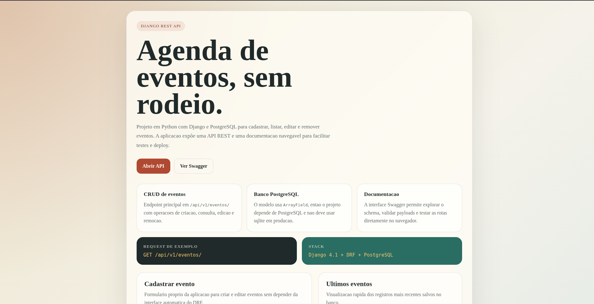
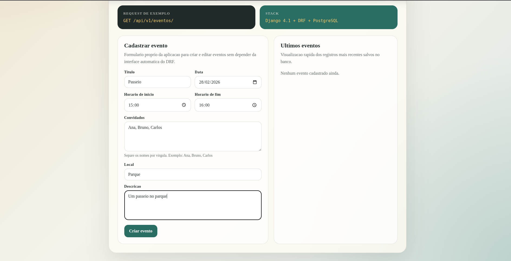
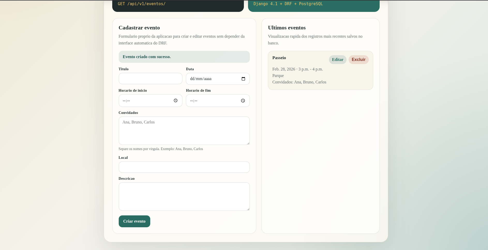
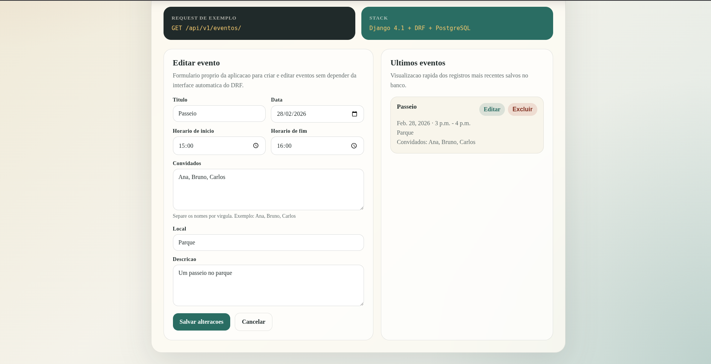
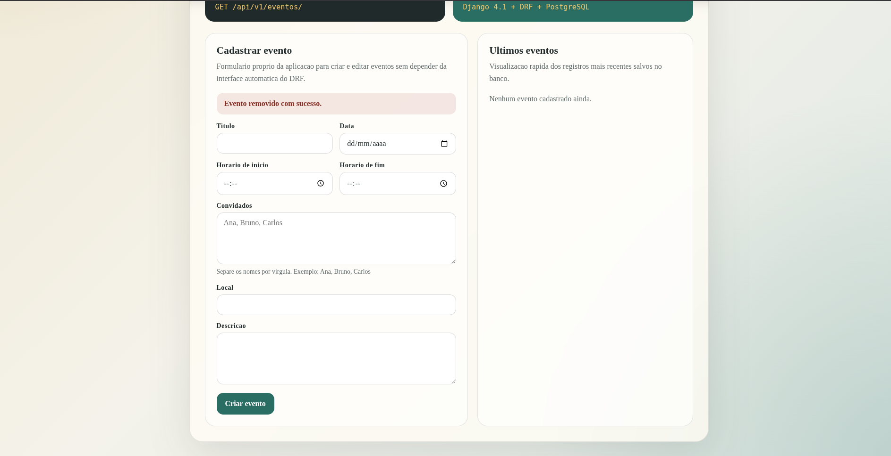

# API Agenda Evento

API REST em Django para criar, listar, editar e remover eventos. O projeto usa PostgreSQL, possui documentacao Swagger e agora expõe uma home inicial para apresentar a aplicacao.

## O que este projeto entrega

- CRUD de eventos em `/api/v1/eventos/`
- documentacao navegavel em `/swagger/`
- pagina inicial em `/` com links para os recursos principais

## Stack

- Python 3.13 no ambiente atual do projeto
- Django 4.1
- Django REST Framework
- PostgreSQL
- WhiteNoise para estaticos em deploy
- `drf-yasg` para Swagger

## Modelo principal

O modelo `Evento` usa `ArrayField` para armazenar convidados. Por isso, o banco precisa ser PostgreSQL. O fallback para `sqlite` existe no `settings.py`, mas nao atende esse modelo em execucao real.

## Como rodar localmente

### 1. Criar ambiente virtual

```bash
python3 -m venv .venv
source .venv/bin/activate
```

### 2. Instalar dependencias

```bash
pip install --upgrade pip setuptools wheel
pip install -r requirements-dev.txt
```

### 3. Subir o banco com Docker

```bash
sudo docker compose up -d
```

O `docker-compose.yml` usa `postgres:15` e expoe a porta `5439`.

### 4. Configurar variaveis de ambiente

```bash
cp .env.example .env
```

### 5. Aplicar migracoes e subir a app

```bash
python manage.py migrate
python manage.py runserver
```

## Rotas principais

- Home: `http://127.0.0.1:8000/`
- API: `http://127.0.0.1:8000/api/v1/eventos/`
- Swagger: `http://127.0.0.1:8000/swagger/`

## Screenshots

### Home principal



### Cadastro de evento



### Evento criado



### Edicao de evento



### Evento removido



## Exemplo de requisicao

```bash
curl -X GET http://127.0.0.1:8000/api/v1/eventos/
```

Exemplo de payload para criar um evento:

```json
{
  "titulo": "Meetup Python",
  "data": "2026-03-10",
  "horario_inicio": "19:00:00",
  "horario_fim": "21:00:00",
  "convidados": ["Ana", "Bruno", "Carlos"],
  "local": "Sao Paulo",
  "descricao": "Encontro da comunidade"
}
```

## Qualidade

Rodar lint:

```bash
flake8
```

Rodar testes:

```bash
pytest
```

## GitHub checklist

Antes de publicar o repositorio:

- mantenha `.env`, `.venv/` e `.pgdata/` fora do versionamento
- confirme que o `README.md` descreve o fluxo real
- rode `flake8` e `pytest`
- revise as variaveis do `.env.example`
- suba um print da home e do Swagger no README se quiser deixar o repositorio mais forte visualmente
